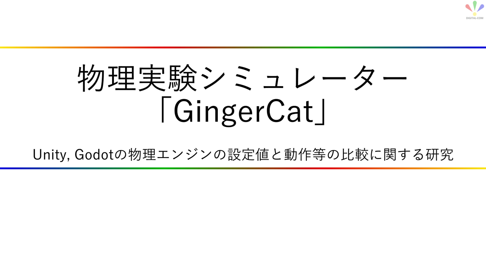
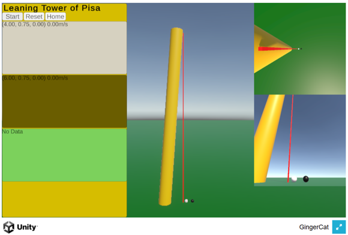
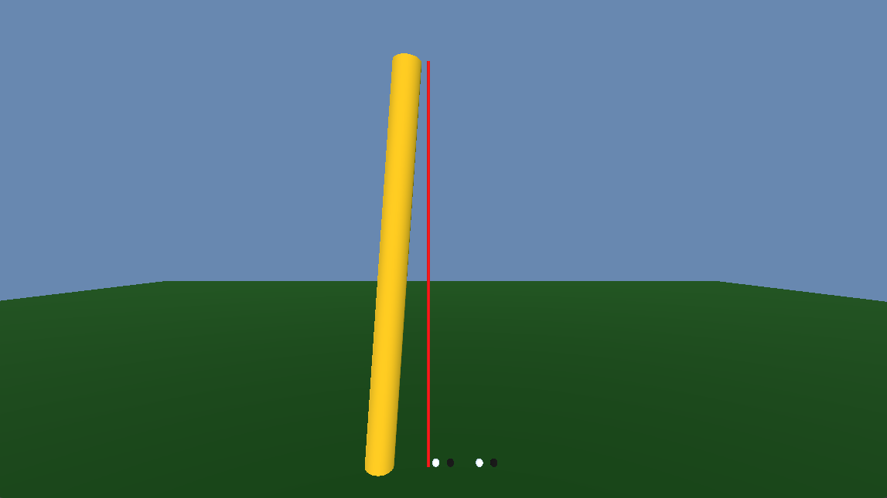

# GingerCat
2024年度デジタルコム先端技術研究会で開発したアプリ



※ Unity版/Godot版ともに、いろいろ機能が足りていない

## 概要
「ガリレオによるピサの斜塔の実験」のような有名な物理実験を題材にして、ゲームエンジン間の物理エンジン設定や動作の違いを体感するのが目的。

Unity と Godot で同等の物理エンジン設定を行った実験シーンを作成し、比較する。


## ピサの斜塔の実験シーン
- 白ボール :  0.1kg
- 黒ボール : 10.0kg

## [Unity版 GingerCat](https://horiuchi-sho.github.io/GingerCat/Unity/index.html)
- ピサの斜塔の実験シーン
  - Startボタンのみ有効。他のボタンは未実装
  - 物体の自由落下と情報表示

  

***

## [Godot版 GingerCat](https://horiuchi-sho.github.io/GingerCat/Godot/index.html)
- ピサの斜塔実験シーン
  - 開始ボタンがないので、やり直す場合はブラウザを更新する必要がある
  - 物体の自由落下のみ
  - 右側の白/黒ボールは重力が1.5倍

  

## 物理エンジンの設定情報の関する調査


| 設定       | Unity                                | Godot                                |
| ---------: | :----------------------------------  | :----------------------------------  |
| 重力       | RigidBody > Use Gravity で OFF/ON    | RigidBody3D > Gravity Scale で重力の強さを設定可能<br> 0ならOFF、1.5 なら1.5倍、2倍にしたら地面貫通した……。 |
| 物体の質量 | RigidBody > Mass に Kg単位で指定     | RigidBody3D > Mass に Kg単位で指定  |


### ボールを自由落下させ、ボールと地面の衝突時にボールをバウンドさせる
(ゲームエンジン間で同じように説明を書くため、ここでの用語はざっくりとしている点に注意)

| ことば           | 説明 |
| ---------------: | :--- |
| オブジェクト     | ここではボールとかの物体を指す
| RigidBody        | ここではオブジェクトに対し、物理エンジンの機能として 重力などを利用するのに必要な要素を指す
| PhysicsMaterial  | ここではオブジェクトに対し、物理エンジンの機能として 物体を弾ませる(バウンド)のに必要な要素を指す


| 設定              | Unity                                                         | Godot                                                        |
| ----------------: | :------------------------------------------------------------ | :----------------------------------------------------------- |
| RigidBody         | オブジェクトにコンポーネントとしてアタッチする                | オブジェクトの親ノードにする
| PhysicsMaterial   | ボール/地面のどちらかに設定する (XXXX Collider の Material)   | ボールに設定する (ボールのRigidBody3D > Physics Material Override) (*1)

- *1 : 未確認だが 地面をStaticBodyで作成しているからPhysicsMaterialを設定できないのであって、RigidBody3Dで作成すればどちらか一方の設定でよいかも？

```
[Unity のオブジェクト構成]
ボールA
- Sphereオブジェクト // オブジェクトの見た目(形)
  - Rigidbody
  - Sphere Collider // オブジェクトの衝突検知

ボールB
- Sphereオブジェクト
  - Rigidbody
  - Sphere Collider

地面
- Cubeオブジェクト
  - Rigidbody
  - Box Collider

--------------------------

[Godot のオブジェクト構成]
ボールA
- RigidBody3D // 以下の子ノードを追加する
  +- MeshInstance3D   // オブジェクトの見た目(形)
  +- CollisionShape3D // オブジェクトの衝突検知

ボールB
- RigidBody3D
  +- MeshInstance3D
  +- CollisionShape3D

地面
- StaticBody3D
  +- MeshInstance3D
  +- CollisionShape3D
```

***

***

# リポジトリ

## ブランチ
- main : 開発用ブランチ
- release : GitHub Pagesで公開するWebアプリの公開用ブランチ (直接commit&pushせず、main->releaseのPRを作成して反映)

### ファイルツリー
```
(root)
  +- README.md : ホームページ相当といて記述する
  +- Godot : Godot版アプリの配置用ディレクトリ。直下に Web でエクスポートした index.html を含むビルド成果物一式を配置する
  +- Unity : Unity版アプリの配置用ディレクトリ。直下に Web を Active にしてビルドした index.html を含むビルド成果物一式を配置する
  +- docs : 最初に公開用としてファイルを配置していたが廃止
```

## Godot版
- Web で エクスポート する

## Unity版
- Build Profile で Web を Active にしてビルド
- "Unable to parse Build/Web.framework.js.br!" エラーの対策
  - Project Settings > Player > Publishing Settings > Decompression Fallback を有効にしてビルドする

